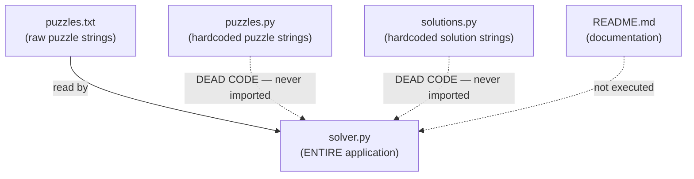
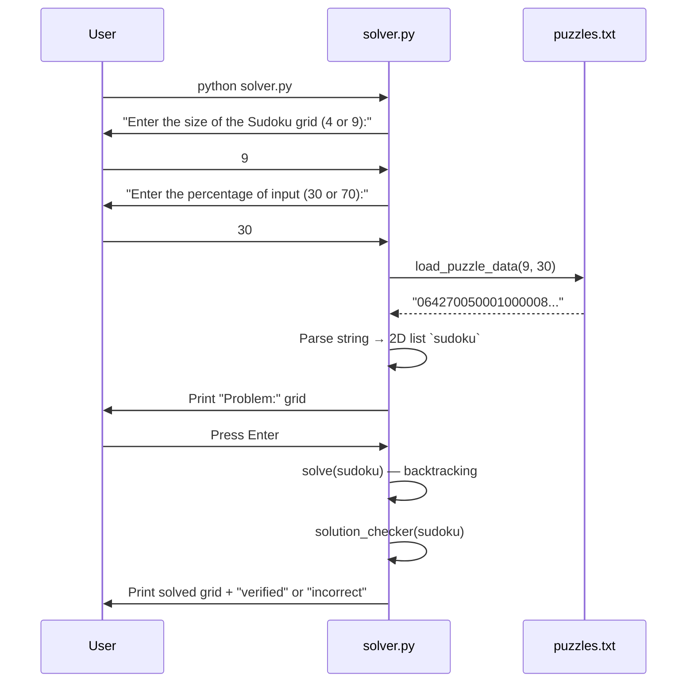

# 🔥 Brutal Staff-Level Code Review: Sudoku Solver

> **Reviewer posture:** Senior Staff SWE, zero tolerance for hand-waving. Every claim backed by line references.

---

## 0. First Impression — Honest Assessment

> [!CAUTION]
> Your prompt says "C++ codebase." This is **100% Python**. If an interviewer catches you calling Python code "C++," the interview is over before it starts. Know your own codebase.

The project is a **CLI-based Sudoku solver** supporting 4×4 and 9×9 grids, using a classic **backtracking** algorithm with no heuristics, no constraint propagation, and no optimizations. It is functional but architecturally naive — which is actually *fine* for an interview as long as you can articulate **why** it's naive and **what** you'd improve.

---

## 1. File & Architecture Mapping



### File-by-File

| File | Lines | Purpose | Actually Used at Runtime? |
|---|---|---|---|
| [solver.py](file:///c:/Users/yasha/OneDrive/Desktop/DATA/Sudoku-Solver-DSA-main/solver.py) | 187 | **The entire application.** Input handling, puzzle loading, grid parsing, backtracking solver, validation, and display — all in one file. | ✅ Yes — this IS the program |
| [puzzles.txt](file:///c:/Users/yasha/OneDrive/Desktop/DATA/Sudoku-Solver-DSA-main/puzzles.txt) | 22 | Flat-text puzzle bank. Puzzles stored as 81-char (9×9) or 16-char (4×4) digit strings, grouped by labels like `# 9x9 70% puzzles`. | ✅ Yes — loaded by `load_puzzle_data()` |
| [puzzles.py](file:///c:/Users/yasha/OneDrive/Desktop/DATA/Sudoku-Solver-DSA-main/puzzles.py) | 21 | Python variables holding the same puzzle strings as `puzzles.txt`. | ❌ **Dead code** — never imported anywhere |
| [solutions.py](file:///c:/Users/yasha/OneDrive/Desktop/DATA/Sudoku-Solver-DSA-main/solutions.py) | 21 | Python variables holding known solutions for validation. | ❌ **Dead code** — never imported anywhere |
| [README.md](file:///c:/Users/yasha/OneDrive/Desktop/DATA/Sudoku-Solver-DSA-main/README.md) | 54 | Documentation. References `python sudoku_solver.py` which doesn't match the actual filename `solver.py`. | N/A |

> [!WARNING]
> **Architecture smell:** There is no architecture. Everything lives in `solver.py` as top-level procedural code with global variables. There's no `main()` function, no class, no module separation. The file executes side effects on import — you cannot unit test this without running the entire interactive flow.

---

## 2. Step-by-Step Execution Flow

Here is the **exact** data flow from `python solver.py` to final output, with line references:



### Detailed Trace

#### Phase 1: Initialization (Lines 1–8)
```python
import os          # For os.system(CLEAR) — screen clearing
import platform    # To detect OS for clear command

if platform.system() == 'Windows':
    CLEAR = 'cls'
else:
    CLEAR = 'clear'
```
Sets a global `CLEAR` variable. This runs at **import time**.

#### Phase 2: User Input (Lines 30–55)

[get_user_input_size()](file:///c:/Users/yasha/OneDrive/Desktop/DATA/Sudoku-Solver-DSA-main/solver.py#L30-L39) — infinite loop with `try/except ValueError`. Only accepts `4` or `9`.

[get_user_input_percentage()](file:///c:/Users/yasha/OneDrive/Desktop/DATA/Sudoku-Solver-DSA-main/solver.py#L42-L51) — same pattern, only accepts `30` or `70`.

**Lines 54–55** execute these at module level:
```python
user_input_size = get_user_input_size()          # GLOBAL
user_input_percentage = get_user_input_percentage()  # GLOBAL
```

> [!IMPORTANT]
> `user_input_size` is a **global variable** that the solver, validator, and printer all depend on. This is the most critical variable in the codebase — it controls loop bounds, subgrid calculations, and display formatting. If you were to refactor, this would become a parameter or class attribute.

#### Phase 3: Puzzle Loading (Lines 11–25)

[load_puzzle_data()](file:///c:/Users/yasha/OneDrive/Desktop/DATA/Sudoku-Solver-DSA-main/solver.py#L11-L25):

```python
def load_puzzle_data(size, percentage):
    filename = 'puzzles.txt'
    with open(filename, 'r') as file:
        content = file.read()                              # Read ENTIRE file into memory
        puzzles = content.split('\n\n')                    # Split on double-newline

    target_label = f'{size}x{size} {percentage}% puzzles'  # e.g., "9x9 30% puzzles"
    for puzzle_section in puzzles:
        if target_label in puzzle_section:                  # String containment check
            puzzle_lines = puzzle_section.split('\n')
            puzzle = ''.join(puzzle_lines[1])               # Take ONLY the FIRST puzzle (index 1)
            return puzzle

    print(f"No puzzle found for size {size} and percentage {percentage}.")
    return ""
```

**Critical detail:** `''.join(puzzle_lines[1])` — `join` on a single string is a **no-op**. `''.join("hello")` returns `"hello"`. This works by accident but reveals the author didn't understand the API. More importantly, **it always picks only the first puzzle** in each section. The other 3 puzzles per category are unreachable dead data.

#### Phase 4: String → 2D Grid (Lines 61–69)

```python
sudoku = []
row = []
for i in range(len(puzzle)):       # Iterate over each character
    row.append(int(puzzle[i]))      # Convert char '0'-'9' to int
    if (i + 1) % user_input_size == 0:  # Every N chars = one row
        sudoku.append(row)
        row = []
```

For a 9×9 grid with puzzle string of length 81:
- Characters 0–8 → row 0
- Characters 9–17 → row 1
- ... and so on

**Result:** `sudoku` is a `list[list[int]]` — a 9×9 (or 4×4) grid where `0` represents empty cells.

#### Phase 5: Display Problem (Lines 170–175)

```python
os.system(CLEAR)
print("\nProblem: \n")
print_sudoku(sudoku)
input("\nPress Enter to See the Solution...")
```

#### Phase 6: Solve (Line 178)

```python
solve(sudoku)  # Mutates `sudoku` in-place
```

This is where the algorithm lives. Covered in exhaustive detail in Section 3.

#### Phase 7: Verify & Display (Lines 180–186)

```python
if solution_checker(sudoku):
    os.system(CLEAR)
    print_sudoku(sudoku)
    print("\nThe solution is verified\n")
else:
    os.system(CLEAR)
    print("\nYour solution is incorrect. Please try again.")
```

> [!NOTE]
> The "Please try again" message is misleading — the **user** didn't solve anything. The algorithm did. If `solution_checker` fails, it means the backtracking algorithm has a bug, not that the user made a mistake.

---

## 3. Deep Algorithmic Breakdown

### 3.1 The Core: `solve(board)` — Backtracking

[solve()](file:///c:/Users/yasha/OneDrive/Desktop/DATA/Sudoku-Solver-DSA-main/solver.py#L74-L102)

```python
def solve(board):
    find = is_empty(board)       # Step 1: Find next empty cell

    if not find:                 # Step 2: BASE CASE — no empty cells
        return True              #   → Puzzle is solved
    else:
        row, col = find          # Step 3: Destructure (row, col) tuple

    for i in range(1, user_input_size + 1):    # Step 4: Try digits 1..N
        if is_valid(board, i, (row, col)):      # Step 5: Check constraints
            board[row][col] = i                  # Step 6: PLACE the digit
            os.system(CLEAR)                     # Step 7: (visual fluff)
            print("\nSolution: \n")
            print_sudoku(sudoku)

            if solve(board):                     # Step 8: RECURSE
                return True

            board[row][col] = 0                  # Step 9: BACKTRACK — undo

    return False                                 # Step 10: DEAD END — trigger backtrack
```

#### Why Backtracking Works for Sudoku — The Formal Argument

Sudoku is a **Constraint Satisfaction Problem (CSP)**. Backtracking is a **depth-first search** over the space of all possible digit assignments. It works because:

1. **Finite search space:** At most 9 choices per cell × 81 cells = 9⁸¹ theoretical max (absurdly large, but pruning kills most branches).
2. **Early pruning:** `is_valid()` rejects a candidate **immediately** if it violates any constraint, preventing exploration of entire subtrees.
3. **Completeness:** If a solution exists, backtracking will find it (it exhaustively searches all valid paths).
4. **Correctness:** Every placed digit passes all three Sudoku constraints. If we reach a state with no empty cells and no constraint violations, we have a valid solution by definition.

#### The Recursion Tree (Conceptual)

```
solve() → find empty cell (0,0)
├── try 1 → is_valid? NO → skip
├── try 2 → is_valid? YES → place 2
│   └── solve() → find empty cell (0,1)
│       ├── try 1 → is_valid? YES → place 1
│       │   └── solve() → find empty cell (0,2)
│       │       ├── ... (continues deeper)
│       │       └── all fail → return False
│       │           ← backtrack: board[0][1] = 0
│       ├── try 2 → is_valid? NO → skip
│       └── ... 
├── try 3 → ...
└── ... all fail → return False (puzzle unsolvable)
```

### 3.2 Constraint Checker: `is_valid(board, num, pos)`

[is_valid()](file:///c:/Users/yasha/OneDrive/Desktop/DATA/Sudoku-Solver-DSA-main/solver.py#L115-L132)

This function answers: *"Can I legally place digit `num` at position `pos` on `board`?"*

It checks **three constraints** in sequence:

#### Constraint 1: Row Uniqueness (Lines 116–118)
```python
for i in range(len(board[0])):              # i iterates over column indices
    if board[pos[0]][i] == num and pos[1] != i:  # Same row, different column
        return False
```
Scans every cell in the same row as `pos`. If `num` already exists there (and it's not the cell itself), reject.

#### Constraint 2: Column Uniqueness (Lines 120–122)
```python
for i in range(len(board)):                 # i iterates over row indices
    if board[i][pos[1]] == num and pos[0] != i:  # Same column, different row
        return False
```
Same logic, but scanning the column.

#### Constraint 3: Subgrid Uniqueness (Lines 124–130)
```python
boardx_x = pos[1] // int(user_input_size**0.5)   # Subgrid column index
boardx_y = pos[0] // int(user_input_size**0.5)   # Subgrid row index

box_size = int(user_input_size**0.5)  # 3 for 9x9, 2 for 4x4

for i in range(boardx_y * box_size, boardx_y * box_size + box_size):
    for j in range(boardx_x * box_size, boardx_x * box_size + box_size):
        if board[i][j] == num and (i, j) != pos:
            return False
```

**How the subgrid math works (this is the part interviewers love to ask about):**

For a 9×9 grid, `user_input_size = 9`, so `box_size = √9 = 3`.

If `pos = (5, 7)`:
- `boardx_y = 5 // 3 = 1` → subgrid row 1
- `boardx_x = 7 // 3 = 2` → subgrid column 2
- Row range: `1*3` to `1*3 + 3` → rows 3, 4, 5
- Col range: `2*3` to `2*3 + 3` → cols 6, 7, 8
- This correctly identifies the bottom-right 3×3 box

```
  Col: 0 1 2 | 3 4 5 | 6 7 8
       ------+-------+------
  R0:  box00 | box01 | box02
  R1:  box00 | box01 | box02
  R2:  box00 | box01 | box02
       ------+-------+------
  R3:  box10 | box11 | box12
  R4:  box10 | box11 | box12
  R5:  box10 | box11 |[box12] ← pos (5,7) lives here
       ------+-------+------
  R6:  box20 | box21 | box22
  R7:  box20 | box21 | box22
  R8:  box20 | box21 | box22
```

### 3.3 Empty Cell Finder: `is_empty(board)`

[is_empty()](file:///c:/Users/yasha/OneDrive/Desktop/DATA/Sudoku-Solver-DSA-main/solver.py#L106-L112)

```python
def is_empty(board):
    for i in range(len(board)):
        for j in range(len(board[0])):
            if board[i][j] == 0:
                return (i, j)       # First empty cell, top-left to bottom-right
    return None                     # No empty cells → puzzle complete
```

**Strategy:** Naive linear scan, top-left to bottom-right. Returns the **first** `0` it finds. No heuristic ordering.

> [!IMPORTANT]
> **Interview talking point — MRV Heuristic:** A massive optimization would be to implement the **Minimum Remaining Values (MRV)** heuristic: instead of picking the first empty cell, pick the empty cell with the **fewest legal candidates**. This dramatically prunes the search tree because cells with fewer options are more constrained and more likely to cause early backtracking. This is the single biggest algorithmic improvement you could make.

### 3.4 Solution Verification: `solution_checker(board)`

[solution_checker()](file:///c:/Users/yasha/OneDrive/Desktop/DATA/Sudoku-Solver-DSA-main/solver.py#L134-L145)

```python
def solution_checker(board):
    for i in range(len(board)):
        for j in range(len(board[0])):
            num = board[i][j]
            if not is_valid(board, num, (i, j)):  # Re-uses is_valid
                print(f"Constraint violated at ({i}, {j}): {num}")
                return False
    return True
```

Iterates over every cell and re-validates it against all three constraints. This is O(N³) where N = grid size (N² cells × N checks per constraint).

> [!WARNING]
> **Bug:** This checker does NOT verify that all cells are filled. If `solve()` somehow returned `True` with zeros still on the board (shouldn't happen with correct backtracking, but defensive code should check), this validator would pass `is_valid(board, 0, ...)` — and since no other cell contains `0`, it would return `True` for an incomplete solution.

---

## 4. Data Structures & Complexity

### 4.1 Data Structures Used

| Data Structure | Where | Why | Alternative & Tradeoff |
|---|---|---|---|
| **`list[list[int]]`** (2D list) | `sudoku` grid | Simple, mutable, direct indexing O(1) | NumPy array — faster for large grids, overkill for 9×9 |
| **`str`** (flat string) | Puzzle storage in `puzzles.txt` | Compact representation, easy parsing | JSON — more structured but verbose |
| **`tuple(int, int)`** | Return from `is_empty()` | Immutable pair for (row, col); Pythonic for multi-return | Named tuple or dataclass — clearer but unnecessary |
| **`list[str]`** | `puzzles` after `.split('\n\n')` | File parsing intermediate | Regex groups — more robust but less readable |
| **Global `int`** | `user_input_size` | Controls all loop bounds | Pass as parameter — far better for testability |

### 4.2 Why No Bitmasks?

In competitive programming, Sudoku solvers often use **bitmasks** (one `int` per row, column, and box) to track which digits are used:

```python
# Bitmask approach (NOT in this codebase):
row_used[r] |= (1 << num)   # Mark digit as used in row r
col_used[c] |= (1 << num)   # Mark digit as used in col c
box_used[b] |= (1 << num)   # Mark digit as used in box b

# Check validity in O(1):
if row_used[r] & (1 << num):  # Already used? Skip.
```

This reduces `is_valid()` from **O(N)** per constraint check to **O(1)**. For a 9×9 grid, that's 27 iterations → 3 bitwise operations. The codebase doesn't use this — be prepared to discuss it.

### 4.3 Time Complexity

Let **N** = grid side length (9 for standard Sudoku), **K** = number of empty cells.

| Operation | Complexity | Explanation |
|---|---|---|
| `is_empty(board)` | **O(N²)** | Linear scan of all cells |
| `is_valid(board, num, pos)` | **O(N)** | Row check: O(N) + Column check: O(N) + Box check: O(√N × √N) = O(N) → total O(N) |
| `solve(board)` — **one recursive call** | **O(N³)** | `is_empty` O(N²) + loop over N digits × `is_valid` O(N) = O(N²) + O(N²) = O(N²). But `print_sudoku` is called on every placement: O(N²). So per recursive call: O(N²). |
| `solve(board)` — **total worst case** | **O(N^(K))** where K ≤ N² | At each of the K empty cells, we try up to N digits. Each attempt costs O(N²). Worst case: N^K × O(N²). For 9×9 with ~50 empties: up to 9⁵⁰ paths explored (though pruning makes real-world performance far better). |
| `solution_checker(board)` | **O(N³)** | N² cells × O(N) per `is_valid` call |
| `print_sudoku(board)` | **O(N²)** | Visit every cell once |

> [!CAUTION]
> **The `os.system(CLEAR)` + `print_sudoku()` inside the solve loop (lines 90–92) is catastrophic for performance.** Every single digit placement — including ones that will be immediately backtracked — clears the screen and re-prints the entire grid. For a hard 9×9 puzzle, this could mean **hundreds of thousands** of system calls and print operations. This is orders of magnitude slower than the actual computation. In a real system, you'd remove this entirely or throttle it.

### 4.4 Space Complexity

| Component | Space | Notes |
|---|---|---|
| `sudoku` grid | **O(N²)** | N×N integers |
| Recursion stack | **O(K)** where K = empty cells | Max depth = number of empty cells. Each frame holds `find`, `row`, `col`, `i`. For 9×9: at most 81 frames ≈ trivial. |
| `puzzles.txt` content | **O(F)** where F = file size | Entire file read into memory. Tiny file, but doesn't scale. |
| **Total** | **O(N² + K)** ≈ **O(N²)** | Dominated by the grid |

### 4.5 In-Place Mutation

> [!NOTE]
> The board is solved **in-place**. `solve(board)` mutates the same `sudoku` list that was created at module level. There is no copy. This is memory-efficient (no O(N²) copies per recursion level) but means the original puzzle is destroyed. If you needed to compare before/after, you'd need to deep-copy beforehand.

---

## 5. 🎯 Interview Ammunition: Bugs, Smells & What They'll Attack

### Bugs

| # | Severity | Location | Issue |
|---|---|---|---|
| 1 | 🔴 High | [L21](file:///c:/Users/yasha/OneDrive/Desktop/DATA/Sudoku-Solver-DSA-main/solver.py#L21) | `''.join(puzzle_lines[1])` — `join` on a string is a no-op. Works by accident. |
| 2 | 🔴 High | [L21](file:///c:/Users/yasha/OneDrive/Desktop/DATA/Sudoku-Solver-DSA-main/solver.py#L21) | Only the first puzzle in each category is ever loaded. Index `[1]` is hardcoded. |
| 3 | 🟡 Medium | [L90-92](file:///c:/Users/yasha/OneDrive/Desktop/DATA/Sudoku-Solver-DSA-main/solver.py#L90-L92) | `os.system(CLEAR)` + `print_sudoku()` inside `solve()` loop — makes backtracking ~1000x slower. |
| 4 | 🟡 Medium | [L186](file:///c:/Users/yasha/OneDrive/Desktop/DATA/Sudoku-Solver-DSA-main/solver.py#L186) | "Please try again" message implies user error; it's an algorithm failure. |
| 5 | 🟢 Low | [L134-145](file:///c:/Users/yasha/OneDrive/Desktop/DATA/Sudoku-Solver-DSA-main/solver.py#L134-L145) | `solution_checker` doesn't verify all cells are non-zero. |

### Design Smells

| Smell | Why It Matters |
|---|---|
| **No `main()` function** | Cannot import `solver.py` without executing the entire interactive flow. Cannot unit test individual functions. |
| **Global mutable state** (`user_input_size`, `sudoku`) | Functions are impure — they depend on and modify global state. Makes reasoning about correctness harder. |
| **`puzzles.py` and `solutions.py` are dead code** | Shipped files that serve no purpose. `solutions.py` could have been used for automated testing but isn't. |
| **`os.system()` for screen clearing** | Security risk (shell injection if `CLEAR` were user-controlled), OS-dependent, and slow. |
| **Repeated `int(user_input_size**0.5)` computation** | Computed at least 5 times per `is_valid` call — should be cached. Minor but shows lack of attention to hot-path optimization. |

### What an Interviewer Will Ask & How to Answer

| Question | Strong Answer |
|---|---|
| *"What's the worst-case time complexity?"* | "O(N^K) where K is the number of empty cells. For a 9×9 board with ~50 empties, that's theoretically 9^50, but constraint pruning reduces this exponentially. Average case for well-formed puzzles is near-instant." |
| *"How would you optimize this?"* | "Three levels: (1) **MRV heuristic** — pick the most constrained cell first. (2) **Constraint propagation** — when placing a digit, eliminate it from peers' candidate lists (AC-3 / Naked Singles). (3) **Bitmask representation** — O(1) validity checks instead of O(N) linear scans." |
| *"Why backtracking over BFS?"* | "DFS/backtracking uses O(K) stack space. BFS would store all partial board states at each level — O(N^K) space, which is completely impractical. Sudoku's solution tree is deep but narrow after pruning, making DFS ideal." |
| *"Is the solution unique?"* | "This solver finds ONE solution and stops. Standard Sudoku puzzles guarantee uniqueness, but this code doesn't verify that. To check uniqueness, you'd continue searching after finding the first solution and return `False` if a second is found." |
| *"How would you test this?"* | "Wrap everything in a class, inject the grid as a parameter, add a `main()` guard. Then: (1) Unit test `is_valid` with edge cases. (2) Unit test `solve` against known solutions from `solutions.py`. (3) Property-based test: solve a puzzle, then verify every row/column/box contains {1..N}." |

---

## 6. Summary: What You MUST Know Cold

```
┌─────────────────────────────────────────────────┐
│           INTERVIEW CHEAT SHEET                 │
├─────────────────────────────────────────────────┤
│ Algorithm:    Backtracking (DFS over CSP)        │
│ Data Struct:  2D Python list (list[list[int]])    │
│ Time:         O(N^K) worst, near-instant avg     │
│ Space:        O(N²) grid + O(K) recursion stack  │
│ Cell Select:  Naive linear scan (no MRV)         │
│ Validation:   O(N) per check (no bitmasks)       │
│ Heuristics:   NONE                               │
│ Constraint    NONE (pure brute backtrack)        │
│  Propagation:                                    │
│ Top Optimize: MRV → Constraint Prop → Bitmasks   │
│ Top Bug:      os.system() in solve loop          │
└─────────────────────────────────────────────────┘
```
